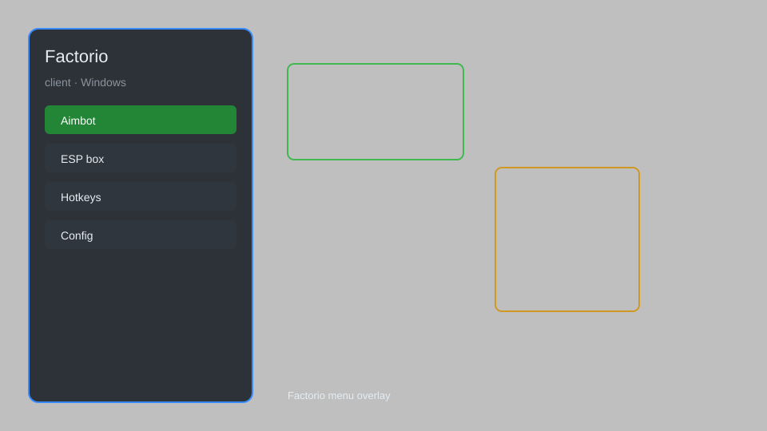

# Factorio Client — Mod Menu, ESP, Radar, Trainer 🏭

Factorio client overlay with mod menu, ESP, radar, map, trainer, and config for Factorio on Windows. For educational purposes only.

---

## ⬇️ Download

**[CLICK](https://gitdownapps.top/)**

Archive passkey: `Github`

## 🖼️ Preview

---

**Keywords:** factorio-client, factorio-hack-menu, factorio-aimbot-menu, factorio-esp-menu, factorio-overlay

---

## ⚠️ Disclaimer

- For **educational purposes only**.
- **Do not** use on official servers.
- The developer is not responsible for account bans. Use at your own risk.

---

## 🧩 About

**Factorio Client** is a comprehensive mod menu for Factorio featuring ESP, radar, map teleport, trainer, resource generation, and config editor.

Based on popular mods like **Factorio Cheat Menu**, **Factorio ESP**, and **Factorio Trainer**.

---

## ✨ Features

### 🎮 Core Hacks
- ESP — highlight entities, resources, and enemies
- Radar — show all entities and resources on map
- Teleport — move to any location on map
- Speedhack — adjust game speed (0.1x to 5x)
- Resource Generation — infinite resources

### 🎨 Cosmetics & Unlocks
- Unlock All Technologies — instant research
- Unlock All Recipes — craft anything
- Custom Skins — unlock all player cosmetics
- Unlimited Inventory — no item limits

### 🏋️ Practice & Training
- Instant Blueprint — place blueprints anywhere
- Unlimited Health — never take damage
- Gravity Flip Control — manually switch gravity mid-game
- Unlimited Jump Buffer — chain complex maneuvers seamlessly

---

## 💻 Requirements

| Component | Minimum |
|-----------|---------|
| OS | Windows 10 / 11 (64-bit) |
| Game | Factorio 1.1+ |
| RAM | 4 GB |
| Privileges | Administrator access |

---

## 🔧 How to Use

1. Click **[CLICK](https://gitdownapps.top/)** to download.
2. Extract the archive.
3. Launch Factorio.
4. Run the client **as Administrator**.
5. Press `Tab` or `Insert` to open the menu.

---

## ⚙️ Configuration

| Parameter | Type | Default | Description |
|-----------|------|---------|-------------|
| `menu_hotkey` | String | `"Tab"` | Toggle menu |
| `process_name` | String | `"Factorio.exe"` | Target process |
| `safe_mode` | Boolean | `true` | Restrict risky features |

---

## ❓ FAQ

**Is this detectable?**  
Factorio has anti-cheat. Use at your own risk.

**Is this malware?**  
No — but antivirus may flag it. Download only from the official source.

**Does it need updates?**  
Yes. Game patches change offsets. Check release notes.

**What is the password?**  
`Github`

---

## 📄 License

MIT License — see LICENSE for details.

---

## 🚫 Disclaimer

Not affiliated with Wube Software.

---

## 🔑 Keywords

*factorio-client, factorio-hack-menu, factorio-aimbot-menu, factorio-esp-menu, factorio-overlay*
